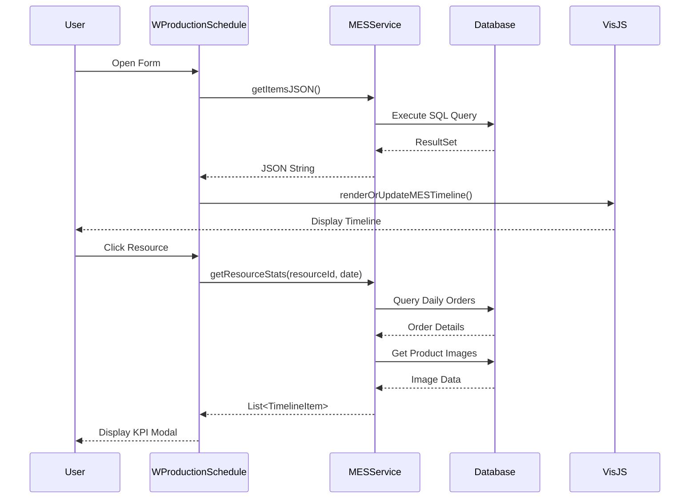
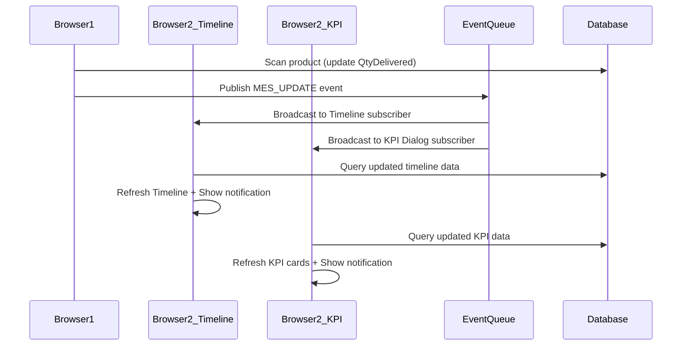

# MES Production Schedule - Technical Architecture

## System Overview

The MES Production Schedule system is a comprehensive web-based manufacturing execution interface built on the iDempiere ERP platform. It provides real-time visualization and management of production orders across manufacturing resources using an interactive timeline interface.

## Architecture Components

### 1. Frontend Layer (ZK Framework)

#### WProductionSchedule.java
**Location**: `tw.idempiere.mes.form.WProductionSchedule`

**Core Responsibilities**:
- Main UI controller extending iDempiere's `ADForm`
- Timeline visualization using Vis.js library
- Resource KPI dialog management
- Event handling and user interactions

**Key Methods**:

| Method | Description | Parameters |
|--------|-------------|------------|
| `initForm()` | Initializes the UI layout and components | None |
| `refreshTimeline()` | Updates timeline with latest production data | None |
| `showResourceDialog(int resourceId)` | Displays KPI modal for specific resource | resourceId: S_Resource_ID |
| `onEvent(Event event)` | ZK event handler for user interactions | Event object |

### 2. Service Layer

#### MESService.java
**Location**: `tw.idempiere.mes.service.MESService`

**Core Responsibilities**:
- Data aggregation from iDempiere database
- JSON generation for timeline visualization
- KPI calculations and statistics

**Key Methods**:

| Method | Return Type | Description |
|--------|-------------|-------------|
| `getItemsJSON(Timestamp date)` | String | Returns timeline items as JSON |
| `getResourceStats(int resourceId, Timestamp date)` | List<TimelineItem> | Returns daily KPI data for a resource |

**Data Model - TimelineItem**:
```java
class TimelineItem {
    int id;                    // PP_Order_Node_ID
    String content;            // Display text
    Timestamp start;           // Schedule start
    Timestamp end;             // Schedule end
    int group;                 // S_Resource_ID
    String className;          // CSS class for styling
    String documentNo;         // Order number
    String productName;        // Product name
    String productValue;       // Product code
    int productId;            // M_Product_ID
    BigDecimal qtyOrdered;    // Target quantity
    BigDecimal qtyDelivered;  // Actual quantity
}
```

### 3. Data Access Layer

#### Database Schema Integration

**Primary Tables**:
- `PP_Order`: Manufacturing orders
- `PP_Order_Node`: Workflow nodes/operations
- `S_Resource`: Manufacturing resources (machines, work centers)
- `M_Product`: Product master data
- `M_Product_Category`: Product categorization
- `AD_Attachment`: Image attachments

**SQL Query Pattern**:
```sql
SELECT 
    pon.PP_Order_Node_ID,
    po.DocumentNo,
    p.Name as ProductName,
    p.Value as ProductValue,
    p.M_Product_ID,
    sr.Name as ResourceName,
    pon.DateStartSchedule,
    pon.DateFinishSchedule,
    po.QtyOrdered,
    po.QtyDelivered
FROM PP_Order_Node pon
JOIN PP_Order po ON pon.PP_Order_ID = po.PP_Order_ID
JOIN M_Product p ON po.M_Product_ID = p.M_Product_ID
JOIN S_Resource sr ON pon.S_Resource_ID = sr.S_Resource_ID
WHERE pon.DateStartSchedule >= ?
ORDER BY sr.Name, pon.DateStartSchedule
```

## UI Component Architecture

### Timeline Visualization

**Technology Stack**:
- **Vis.js 4.21.0**: Timeline rendering library
- **ZK Framework**: Server-side UI framework
- **JavaScript Bridge**: `Clients.evalJavaScript()` for Java-JS communication

**Timeline Configuration**:
```javascript
{
    stack: false,           // Non-overlapping items
    editable: false,        // Read-only timeline
    orientation: 'top',     // Header position
    groupOrder: 'content',  // Alphabetical resource sorting
    zoomMin: 86400000,     // Minimum zoom: 1 day
    zoomMax: 31536000000   // Maximum zoom: 1 year
}
```

### Resource KPI Dialog

**Layout Structure**:
```
┌─────────────────────────────────────────────────┐
│  Daily KPI: [Resource Name]        Date Picker  │
├─────────────────────────────────────────────────┤
│  ┌────────────┬────────────────┬──────────────┐ │
│  │   Image    │  Product Info  │  Performance │ │
│  │  (33%)     │     (33%)      │    (34%)     │ │
│  ├────────────┼────────────────┼──────────────┤ │
│  │            │ Order: [#]     │ Target: 100  │ │
│  │  [Product  │ [Product Name] │ Delivered:80 │ │
│  │   Image]   │ Code: [Value]  │              │ │
│  │  250x250   │                │    80%       │ │
│  │            │                │  (84px font) │ │
│  └────────────┴────────────────┴──────────────┘ │
└─────────────────────────────────────────────────┘
```

**Responsive Behavior**:
- Single order: Vertical centering applied
- Multiple orders: Vertical stacking with scrolling
- Card height: `max-height: 48%` per card
- Full-screen modal: `width: 100%, height: 100%`

## Data Flow Architecture



## Image Attachment Integration

**Process Flow**:
1. Query `M_Product_ID` for each order
2. Fetch attachment: `MAttachment.get(ctx, TABLE_ID_208, productId)`
3. Extract first entry: `attachment.getEntry(0)`
4. Convert to ZK Image: `new AImage("prod", imageBytes)`
5. Display in UI with CSS constraints: `max-width: 100%; max-height: 100%`

**Fallback Strategy**:
- No attachment → Display "No Image" placeholder
- Invalid image data → Silent fail with placeholder
- Multiple attachments → Use first entry only

## Performance Considerations

### Optimization Strategies
1. **Lazy Loading**: KPI images loaded only when dialog opens
2. **Query Batching**: Single SQL query fetches all timeline data
3. **JavaScript Debouncing**: Timeline re-renders wait for data stability
4. **ZK Server Push**: Disabled to reduce overhead (polling on refresh instead)

### Scalability Limits
- Timeline items: ~500 concurrent orders
- Date range: 1 month recommended max
- Resources: 50-100 visible resources

## Security & Access Control

### iDempiere Integration
- Inherits iDempiere role-based access control (RBAC)
- Resource visibility filtered by `AD_Org_ID`
- Read-only by design (no direct order modifications)

### Data Validation
- Date inputs sanitized through `Timestamp` conversion
- Resource IDs validated against `S_Resource` table
- SQL injection protected via `PreparedStatement`

## Extension Points

### Adding Custom Fields
1. Modify `TimelineItem` class in `MESService.java`
2. Update SQL queries to include new fields
3. Extend KPI dialog UI in `showResourceDialog()`

### Custom Styling
- Timeline CSS: Override `.vis-item` classes
- KPI Cards: Modify inline styles in `card.setStyle()`
- Colors: Update status-based color logic

## Technology Dependencies

| Component | Version | Purpose |
|-----------|---------|---------|
| iDempiere | 12.x | Core ERP platform |
| ZK Framework | 9.x | Web UI framework |
| Vis.js | 4.21.0 | Timeline visualization |
| PostgreSQL | 12+ | Database backend |
| Gson | 2.x | JSON serialization |

## Deployment Architecture

```
┌─────────────────────────────────────┐
│     Client Browser                   │
│  ┌──────────────────────────────┐   │
│  │  Vis.js Timeline (JavaScript)│   │
│  └──────────────────────────────┘   │
└─────────────────────────────────────┘
            ↕ HTTP/AJAX
┌─────────────────────────────────────┐
│    Application Server (ZK)          │
│  ┌──────────────────────────────┐   │
│  │  WProductionSchedule.java    │   │
│  │  MESService.java             │   │
│  └──────────────────────────────┘   │
└─────────────────────────────────────┘
            ↕ JDBC
┌─────────────────────────────────────┐
│    PostgreSQL Database              │
│    (iDempiere Schema)               │
└─────────────────────────────────────┘
```

## Error Handling

### Exception Management
- Image loading failures: Silent degradation to placeholder
- Database connection issues: User-friendly error dialog
- Invalid date ranges: Default to current date
- Missing resources: Empty timeline with warning message

### Logging Strategy
- SQL errors → `CLogger` with stack traces
- UI events → Debug level logging
- Performance metrics → Optional profiling mode

## Real-time Cross-Browser Synchronization (ZK EventQueue)

### Overview

The system implements **real-time cross-browser synchronization** using ZK Framework's EventQueue mechanism. When operators scan products in the barcode dialog on one browser, all other open KPI dialogs across different browsers/sessions automatically refresh to show updated quantities without manual refresh.


### Architecture

The EventQueue enables **two types of subscribers**:
1. **KPI Dialog**: Auto-refreshes when viewing a specific resource
2. **Timeline View**: Auto-refreshes the main schedule view




### Implementation Details

#### Constants

```java
// Event Queue Configuration
private static final String EVENT_QUEUE_NAME = "MesUpdateQueue";
private static final String EVENT_NAME_UPDATE = "MES_UPDATE";
```

#### Publisher (Barcode Scan Dialog)

**Location**: `showPackingDialog()` method, ~line 1010

**Trigger**: After successful product scan and DB update

```java
// Publish event after successful scan
int orderId = DB.getSQLValue(null,
    "SELECT PP_Order_ID FROM PP_Order WHERE DocumentNo=? AND M_Product_ID=?",
    orderNo, productId);

EventQueue<Event> queue = EventQueues.lookup(
    EVENT_QUEUE_NAME, 
    EventQueues.APPLICATION, 
    true);

Event mesEvent = new Event(EVENT_NAME_UPDATE, null, 
    new Object[] { orderId, productId, qty });
queue.publish(mesEvent);
```

**Event Payload**:
- `orderId` (Integer): PP_Order_ID that was updated
- `productId` (Integer): M_Product_ID that was scanned
- `qty` (Integer): Quantity that was added

#### Subscriber (KPI Dialog)

**Location**: `subscribeKPIDialogToEvents()` helper method, ~line 880

**Lifecycle**: Subscribes when KPI dialog opens, unsubscribes when closed

```java
// Enable server push for real-time updates
Executions.getCurrent().getDesktop().enableServerPush(true);

// Subscribe to event queue
EventQueue<Event> queue = EventQueues.lookup(
    EVENT_QUEUE_NAME, 
    EventQueues.APPLICATION, 
    true);

queue.subscribe(new EventListener<Event>() {
    public void onEvent(Event event) throws Exception {
        if (EVENT_NAME_UPDATE.equals(event.getName())) {
            Object[] data = (Object[]) event.getData();
            
            // Schedule UI refresh on ZK desktop thread
            Executions.schedule(kpiDesktop, new EventListener<Event>() {
                public void onEvent(Event evt) throws Exception {
                    refreshCallback.run();  // Reload KPI data
                    
                    // Show notification
                    Clients.showNotification(
                        "🔴 Remote Scan! Order " + docNo + " updated",
                        "info", null, "top_right", 3000);
                }
            }, new Event("updateKPI"));
        }
    }
});
```

#### Subscriber #2: Timeline View

**Location**: `subscribeTimelineToEvents()` helper method, ~line 968

**Lifecycle**: Subscribes when Timeline initializes (in `initForm()`), active for entire session

```java
// Enable server push for Timeline
Desktop timelineDesktop = Executions.getCurrent().getDesktop();
timelineDesktop.enableServerPush(true);

// Subscribe to event queue
EventQueue<Event> queue = EventQueues.lookup(
    EVENT_QUEUE_NAME, 
    EventQueues.APPLICATION, 
    true);

queue.subscribe(new EventListener<Event>() {
    public void onEvent(Event event) throws Exception {
        if (EVENT_NAME_UPDATE.equals(event.getName())) {
            Object[] data = (Object[]) event.getData();
            
            // Schedule Timeline refresh on ZK desktop thread
            Executions.schedule(timelineDesktop, new EventListener<Event>() {
                public void onEvent(Event evt) throws Exception {
                    refreshTimeline();  // Reload entire Timeline
                    
                    // Show notification
                    Clients.showNotification(
                        "🔄 Order " + docNo + " updated - Timeline refreshed",
                        "info", null, "top_right", 3000);
                }
            }, new Event("updateTimeline"));
        }
    }
});
```

### Server Push Configuration

**Requirement**: ZK Server Push must be enabled for each Desktop that receives updates.

```java
// Enable in KPI dialog (subscriber)
Executions.getCurrent().getDesktop().enableServerPush(true);
```

**Behavior**:
- Push mode: Server polls client every ~10 seconds (default ZK polling interval)
- Events are queued and delivered during next poll cycle
- Typical latency: 1-10 seconds depending on server/network load

### Event Flow Diagram

```
┌─────────────────────────┐         ┌─────────────────────────┐
│   Browser A             │         │   Browser B             │
│  ┌──────────────────┐   │         │  ┌──────────────────┐   │
│  │  KPI Dialog      │   │         │  │  KPI Dialog      │   │
│  │  (Subscriber)    │   │         │  │  (Subscriber)    │   │
│  └──────────────────┘   │         │  └──────────────────┘   │
│         ↑ ③              │         │         ↑ ③              │
│         │                │         │         │                │
│  ┌──────────────────┐   │         │  ┌──────────────────┐   │
│  │  Scan Dialog     │   │         │  │  (Waiting...)    │   │
│  │  ① Scan Product  │   │         │  │                  │   │
│  │  ② Publish Event │───┼─────────┼─▶│ EventQueue       │   │
│  └──────────────────┘   │         │  │ (Application     │   │
│                          │         │  │  Scope)          │   │
└─────────────────────────┘         └──┴──────────────────┴───┘
                                         │                 │
                                         └─────────────────┘
                                    ③ Broadcast to all subscribers
```

### Performance Characteristics

| Metric | Value | Notes |
|--------|-------|-------|
| **Latency** | 1-10 seconds | Depends on ZK polling interval |
| **Scope** | Application-wide | All users, all sessions |
| **Max Subscribers** | ~100 concurrent | ZK framework limit |
| **Event Size** | <1KB | Payload: 3 integers |
| **Server Load** | Low | Event queue is memory-based |

### Debugging

**Enable Debug Logging**:

All EventQueue operations log to console with prefix `=== DEBUG:`

```java
// Publisher logs
System.out.println("=== DEBUG: [Packing Dialog] *** PUBLISHING EVENT ***");
System.out.println("=== DEBUG: [Packing Dialog] Queue retrieved: " + queue);
System.out.println("=== DEBUG: [Packing Dialog] *** EVENT PUBLISHED SUCCESSFULLY ***");

// KPI Dialog subscriber logs  
System.out.println("=== DEBUG: [KPI Dialog] Subscribing to EventQueue");
System.out.println("=== DEBUG: [KPI Dialog] *** EVENT RECEIVED *** Name: " + event.getName());
System.out.println("=== DEBUG: [KPI Dialog] Scheduling refresh...");
System.out.println("=== DEBUG: [KPI Dialog] Refresh completed!");

// Timeline subscriber logs
System.out.println("=== DEBUG: [Timeline] Subscribing to EventQueue");
System.out.println("=== DEBUG: [Timeline] Server Push Enabled");
System.out.println("=== DEBUG: [Timeline] *** EVENT RECEIVED *** Name: " + event.getName());
System.out.println("=== DEBUG: [Timeline] Scheduling Timeline refresh...");
System.out.println("=== DEBUG: [Timeline] Executing Timeline refresh");
System.out.println("=== DEBUG: [Timeline] Timeline refresh completed!");
```

**Common Debug Scenarios**:

1. **Event published but not received**:
   - Check if subscriber desktop is still alive
   - Verify server push is enabled
   - Confirm event queue name matches (`MesUpdateQueue`)

2. **Multiple refreshes triggered**:
   - Normal if multiple KPI dialogs are open
   - Each subscriber receives the broadcast independently

3. **Delayed updates (>15 seconds)**:
   - Network latency
   - Server under heavy load
   - Consider adjusting ZK polling interval in `zk.xml`

### Configuration Options

**To adjust polling interval** (optional, not recommended to change without testing):

Add to `WEB-INF/zk.xml`:
```xml
<device-config>
    <device-type>ajax</device-type>
    <polling-interval>3000</polling-interval> <!-- milliseconds -->
</device-config>
```

**Trade-offs**:
- Shorter interval = faster updates, higher server load
- Longer interval = lower load, slower updates
- Default (no config) = ~10 seconds, balanced performance

### Security Considerations

**Access Control**:
- EventQueue is application-scoped (shared across all users)
- No built-in authorization - all users receive all events
- Events contain only IDs, not sensitive product/order data
- Actual data queried from database respects iDempiere RBAC

**Best Practices**:
- Don't publish sensitive data in event payload
- Use IDs only, fetch details server-side
- Validate orderId/productId before processing events

### Limitations

1. **Polling Mode**: Uses ZK's default polling, not true WebSocket push
2. **No Historical Events**: Late-joining subscribers don't see past events
3. **No Guaranteed Delivery**: If browser is offline during publish, update is lost
4. **Single Event Type**: All updates use same `MES_UPDATE` event name

### Future Enhancements

To improve real-time performance:
1. Enable ZK Comet or WebSocket mode for sub-second latency
2. Implement event replay for late joiners
3. Add event filtering by resource/product
4. Implement delivery confirmation/acknowledgment

## Future Enhancement Recommendations

1. **WebSocket Push**: Upgrade from polling to WebSocket for <1s latency
2. **Drag-and-Drop Scheduling**: Make timeline editable for manual scheduling
3. **Mobile Responsiveness**: Optimize KPI dialog for tablet viewing
4. **Export Functionality**: Add PDF/Excel export for schedule reports
5. **Advanced Filtering**: Multi-resource and product category filters


# MES Production Schedule - User Guide

## Introduction

The MES Production Schedule is your command center for manufacturing operations. This guide will help you navigate the system, understand production timelines, and monitor shop floor performance.

---

## Getting Started

### Accessing the System

1. Log into iDempiere
2. Navigate to: **Manufacturing** → **Production Management** → **MES Production Schedule**
3. The timeline view will load automatically showing today's schedule

### System Requirements

- **Browser**: Chrome, Firefox, or Edge (latest versions)
- **Screen Resolution**: Minimum 1280x720, recommended 1920x1080
- **Permissions**: Manufacturing user role or higher

---

## Understanding the Timeline View

### Screen Layout

```
┌────────────────────────────────────────────────────────┐
│  MES Production Schedule                    [X] Close  │
├────────────────────────────────────────────────────────┤
│  [<] [Today] [>]     Resource Group: [All ▼]  [Filter]│
├────────────────────────────────────────────────────────┤
│  Resource 1  ████████░░░░░░░░                          │
│  Resource 2  ░░░░████████░░░░                          │
│  Resource 3  ░░░░░░░░████████████                      │
│  Resource 4  ████░░░░░░░░                              │
└────────────────────────────────────────────────────────┘
```

### Timeline Components

#### 1. **Resource Bars** (Left Side)
Each row represents a manufacturing resource:
- Machine tools (e.g., "CNC-01", "Lathe-02")
- Work centers (e.g., "Assembly Line A")
- Manual workstations (e.g., "Packing Station 3")

#### 2. **Order Blocks** (Timeline Bars)
Colored rectangular blocks represent production orders:

| Color | Status | Meaning |
|-------|--------|---------|
| 🔵 Blue | Scheduled | Order is planned but not started |
| 🟡 Yellow | In Progress | Currently being manufactured |
| 🟢 Green | Completed | Finished and delivered |
| 🔴 Red | At Risk | Behind schedule or issues detected |

#### 3. **Time Scale** (Top)
- Horizontal axis shows dates and times
- Scroll horizontally to view past or future schedules
- Zoom in/out using mouse wheel or pinch gesture

---

## Navigating the Timeline

### Basic Navigation

**Scrolling**:
- **Vertical**: Scroll up/down to see different resources
- **Horizontal**: Scroll left/right to view different time periods

**Zooming**:
- **Mouse Wheel**: Scroll while hovering over timeline
- **Pinch Gesture**: On touchscreens, pinch to zoom
- **Date Buttons**: Click `[<]` or `[>]` to move day-by-day

**Filtering**:
1. Click the **Resource Group** dropdown
2. Select a specific department or group
3. Timeline updates to show only those resources

### Reading Order Information

**Hover over any order block** to see a tooltip:
- Order Number (e.g., "PO-2024-001")
- Product Name
- Scheduled Start/End Time
- Current Status

**Click on any order block** for detailed information (see next section)

---

## Understanding the KPI Dialog

### Opening the KPI View

**Method 1**: Click directly on any order block in the timeline  
**Method 2**: Click on the resource name to see all orders for that resource

### KPI Dialog Layout

The KPI dialog is divided into three sections:

```
┌───────────────────────────────────────────────────────┐
│  Daily KPI: CNC Machine 01        📅 2024-01-24      │
├─────────────┬─────────────────┬─────────────────────┤
│   IMAGE     │   ORDER INFO    │   PERFORMANCE       │
│   (Left)    │    (Middle)     │     (Right)         │
├─────────────┼─────────────────┼─────────────────────┤
│   [Photo]   │ Order: PO-001   │ Target: 100 units   │
│   Product   │ Widget Pro-X    │ Delivered: 75 units │
│   250x250px │ Code: WDG-001   │                     │
│             │                 │      75%            │
│             │                 │   (Large %)         │
└─────────────┴─────────────────┴─────────────────────┘
```

#### **Left Column: Product Image**
- Displays the product photo for visual identification
- Helps operators confirm they're working on the correct item
- If no image is available, shows "No Image" placeholder

#### **Middle Column: Order Details**
- **Order Number**: Production order reference
- **Product Name**: Full product description
- **Code**: Internal product code/SKU

#### **Right Column: Performance Metrics**
- **Target**: Total quantity ordered
- **Delivered**: Quantity completed so far
- **Completion Rate**: Large percentage display
  - 🟢 **Green** if 100% or above (order complete/ahead)
  - 🔴 **Red** if below 100% (still in progress)

### Interpreting Performance

**Reading the Completion Rate**:
- **0-25%**: Just started
- **26-75%**: In progress
- **76-99%**: Nearly complete
- **100%+**: Complete (may indicate overproduction)

**What to Do**:
- **Green (100%+)**: Order complete, ready to move to next operation
- **Red (<100%)**: Check if additional time/resources needed
- **High percentage late in day**: Good progress, on track
- **Low percentage late in day**: May need intervention or overtime

---

## Common Tasks

### Task 1: Check Today's Schedule

1. Open the MES Production Schedule
2. Click **[Today]** button to center on current date
3. Scan the timeline for your resources
4. Look for red (at-risk) orders that need attention

### Task 2: Review a Specific Order

1. Use search or scroll to find the order block
2. Click on the order
3. Review completion percentage
4. If behind schedule, note the gap between target and delivered

### Task 3: Monitor a Specific Machine

1. Click on the machine/resource name in the left column
2. The KPI dialog shows all orders for that resource today
3. Scroll through multiple orders if applicable
4. Use the date picker at the top to view other days

### Task 4: Plan for Tomorrow

1. Click the **[>]** arrow to advance one day
2. Review upcoming scheduled orders
3. Note any resource conflicts (overlapping bars)
4. Coordinate with planning if adjustments needed

### Task 5: Check Department Load

1. Select your department from the **Resource Group** filter
2. Count the number of active (yellow) orders
3. Identify idle resources (no bars) that could take new work
4. Report over-allocated resources (many overlapping bars)

---

## Best Practices

### For Shop Floor Supervisors

✅ **DO**:
- Check the schedule at the start of each shift
- Click on red (at-risk) orders immediately to assess the issue
- Use KPI dialog to verify operators are working on correct products
- Keep product images updated for easy visual verification

❌ **DON'T**:
- Ignore red-colored orders—they indicate a problem
- Assume the schedule is always current (refresh periodically)
- Skip verification of product images against physical items

### For Production Planners

✅ **DO**:
- Review the full week's schedule every Monday
- Use zoom feature to see hourly details during shift changes
- Filter by resource group to balance workloads
- Check for gaps (idle time) that could be filled

❌ **DON'T**:
- Overload a single resource (too many overlapping bars)
- Ignore historical completion rates when planning
- Schedule without considering setup/changeover time

### For Operators

✅ **DO**:
- Verify product image matches your workpiece before starting
- Report immediately if your completion rate falls below expected
- Use the KPI % to gauge if you're on pace for the day
- Note your order number from the screen for traceability

❌ **DON'T**:
- Start work without checking the current order in the system
- Continue producing if rate shows >100% without supervisor approval
- Ignore discrepancies between screen data and physical reality

---

## Troubleshooting

### Problem: "No image shown for products"

**Solution**:
1. Go to **Product Window** in iDempiere
2. Find the product record
3. Click the **Attachment** (📎) icon
4. Upload a product photo (JPG or PNG recommended)
5. Save the record
6. Refresh the MES schedule to see the image

### Problem: "Timeline shows old data"

**Solution**:
- Click the **Refresh** button (🔄) in the toolbar
- Close and reopen the form
- Check with IT if the problem persists (may be a caching issue)

### Problem: "Orders overlapping on the same resource"

**Meaning**: This indicates a scheduling conflict

**Action**:
1. Click on each overlapping order to see details
2. Verify start/end times
3. Contact production planning to adjust schedule
4. May need to reassign one order to a different resource

### Problem: "Red (at-risk) order but we're on track"

**Possible Causes**:
- Delivered quantity not updated in the system
- Schedule was overly optimistic
- Classification rules need adjustment

**Action**:
1. Verify actual delivered quantity
2. Update the production order in iDempiere
3. Refresh the timeline to see updated status

### Problem: "Can't see my resource in the list"

**Possible Causes**:
- Wrong resource group filter selected
- Resource is inactive in the system
- Permission issue (restricted by organization)

**Action**:
1. Set Resource Group filter to **[All]**
2. Scroll through the full list
3. If still missing, contact your administrator

---

## Tips for Maximum Productivity

### 📱 For Large Shop Floor Displays

- Use a dedicated large monitor or TV screen
- Set browser to **full-screen mode** (F11)
- Position near the production floor for easy visibility
- Refresh schedule every 15-30 minutes during shift

### ⌨️ Keyboard Shortcuts

| Shortcut | Action |
|----------|--------|
| `Left/Right Arrow` | Move timeline by one day |
| `Home` | Jump to today |
| `+` / `-` | Zoom in/out |
| `Esc` | Close KPI dialog |

### 🎨 Color Customization

If your organization has customized the color scheme:
- Ask your administrator for a color key specific to your system
- Standard colors may differ based on local configuration

### 📊 Recommended Workflow

**Morning (Shift Start)**:
1. Open MES schedule
2. Filter to your department
3. Review all orders for the day
4. Note any red orders for immediate action

**Mid-Shift**:
1. Refresh timeline
2. Check progress on critical orders
3. Update delivered quantities if not auto-synced

**End of Shift**:
1. Review completed orders (green)
2. Note incomplete orders for handoff
3. Check tomorrow's schedule for preparation

---

## Integration with Other iDempiere Functions

### Material Requisitions
- Orders in the timeline reflect material reservations
- If materials are unavailable, orders may show as at-risk

### Quality Control
- Completed orders (green) should trigger QC inspections
- Failed QC may cause orders to revert to yellow/red

### Shipping
- Green orders with 100%+ are ready for shipment processing
- Coordinate with logistics when multiple orders complete

---

## Getting Help

### Support Resources

1. **Training Videos**: Check company intranet for tutorial videos
2. **Help Desk**: Submit a ticket for technical issues
3. **Super Users**: Contact designated MES experts in your facility
4. **This Guide**: Bookmark this document for quick reference

### Reporting Issues

When contacting support, please provide:
- Screenshot of the issue
- Order number or resource name
- Date and time of the problem
- Steps you took before the issue occurred

---

## Appendix: Glossary

| Term | Definition |
|------|------------|
| **Order Block** | Rectangular bar on timeline representing a production order |
| **Resource** | Manufacturing equipment or work center (machine, assembly line, etc.) |
| **KPI** | Key Performance Indicator (metrics showing performance) |
| **Timeline** | Horizontal view showing scheduled orders across time |
| **Completion Rate** | Percentage of delivered quantity vs. target quantity |
| **At-Risk** | Order that is behind schedule or has other issues |
| **Resource Group** | Collection of related resources (e.g., all CNC machines) |

---

## Quick Reference Card

### Visual Status Guide

| What You See | What It Means | What To Do |
|--------------|---------------|------------|
| 🔵 Blue bar | Order scheduled, not started | Prepare materials and setup |
| 🟡 Yellow bar | Order in progress | Continue work, monitor progress |
| 🟢 Green bar | Order complete | Move to QC or next operation |
| 🔴 Red bar | Order at risk | Investigate and take corrective action |
| No bar (gap) | Resource idle | Schedule new work or perform maintenance |
| Overlapping bars | Schedule conflict | Alert planning immediately |

### Performance Indicators

| Completion % | Status | Interpretation |
|--------------|--------|----------------|
| 0-25% | 🟡 Early | Just started, plenty of time |
| 26-75% | 🟡 On Track | Normal progress |
| 76-99% | 🟡 Nearly Done | Almost complete |
| 100% | 🟢 Complete | Ready for next step |
| >100% | 🟠 Over | May indicate overproduction |
| <Expected (late in day) | 🔴 Behind | Needs urgent attention |

---

**Document Version**: 1.0  
**Last Updated**: January 2024  
**For**: MES Production Schedule System  
**Questions?** Contact your MES administrator
