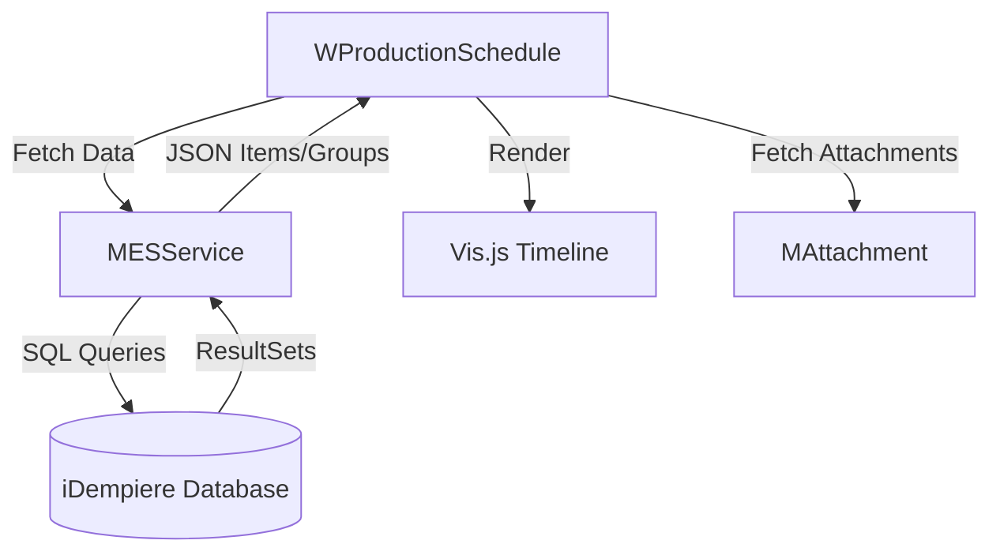

# MES Production Schedule - Technical Architecture

## Overview
The MES Production Schedule is a ZK-based graphical interface designed to manage and monitor production orders in real-time. It provides a visual timeline of scheduled work and key performance indicators (KPIs) for manufacturing resources.

## Component Structure

### 1. WProductionSchedule (Frontend - ZK)
The main entry point is `tw.idempiere.mes.form.WProductionSchedule`. This component handles:
- **Timeline Visualization**: Uses the `Vis.js` library (via an HTML/JS bridge) to render production orders as interactive blocks on a resource-based horizontal axis.
- **Resource Summary**: A header section showing real-time resource status and overall performance.
- **KPI Dialogs**: Interactive popups that provide detailed views of daily production targets vs. actual performance for specific machines/work centers.
- **Filtering Logic**: Allows users to filter by resource groups and date ranges.

### 2. MESService (Backend - Java/SQL)
The `tw.idempiere.mes.service.MESService` serves as the data provider:
- **Data Aggregation**: Executes complex SQL queries to combine data from `PP_Order`, `M_Product`, `S_Resource`, and `PP_Order_Node`.
- **JSON Generation**: Formats production data into JSON structures (using `Gson`) compatible with the `Vis.js` timeline expectations.
- **KPI Engine**: Calculates completion rates and identifies "at-risk" orders based on delivery timelines and quantities.

## Data Flow

## Key Classes & Methods

| Class | Method | Responsibility |
|-------|--------|----------------|
| `WProductionSchedule` | `refreshTimeline` | Clears and re-renders the timeline view. |
| `WProductionSchedule` | `showResourceDialog` | Displays the modal KPI view for a resource. |
| `MESService` | `getItemsJSON` | Generates the timeline data in JSON format. |
| `MESService` | `getResourceStats` | Fetches KPI stats (ordered vs delivered) for a specific date. |

## Technical Implementation Details
- **Image Integration**: The Resource KPI dialog dynamically fetches product images from the `MAttachment` table (TableID: 208) using `M_Product_ID`.
- **ZUL Layout**: Uses `Div`, `Vbox`, and `Hbox` with CSS Flexbox styles to achieve responsive and aesthetic layouts.
- **Communication**: Uses `Clients.evalJavaScript` to bridge the gap between Java-based ZK and client-side JavaScript (Vis.js).
