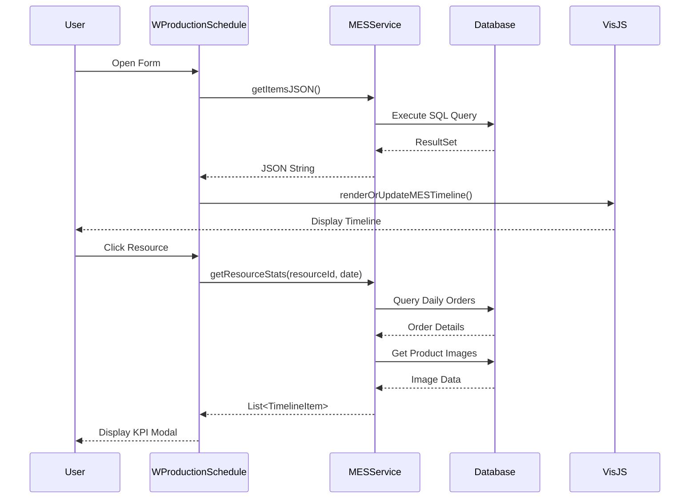

# MES Production Schedule - Technical Architecture (Claude)

## System Overview

The MES Production Schedule system is a comprehensive web-based manufacturing execution interface built on the iDempiere ERP platform. It provides real-time visualization and management of production orders across manufacturing resources using an interactive timeline interface.

## Architecture Components

### 1. Frontend Layer (ZK Framework)

#### WProductionSchedule.java
**Location**: `tw.idempiere.mes.form.WProductionSchedule`

**Core Responsibilities**:
- Main UI controller extending iDempiere's `ADForm`
- Timeline visualization using Vis.js library
- Resource KPI dialog management
- Event handling and user interactions

**Key Methods**:

| Method | Description | Parameters |
|--------|-------------|------------|
| `initForm()` | Initializes the UI layout and components | None |
| `refreshTimeline()` | Updates timeline with latest production data | None |
| `showResourceDialog(int resourceId)` | Displays KPI modal for specific resource | resourceId: S_Resource_ID |
| `onEvent(Event event)` | ZK event handler for user interactions | Event object |

### 2. Service Layer

#### MESService.java
**Location**: `tw.idempiere.mes.service.MESService`

**Core Responsibilities**:
- Data aggregation from iDempiere database
- JSON generation for timeline visualization
- KPI calculations and statistics

**Key Methods**:

| Method | Return Type | Description |
|--------|-------------|-------------|
| `getItemsJSON(Timestamp date)` | String | Returns timeline items as JSON |
| `getResourceStats(int resourceId, Timestamp date)` | List<TimelineItem> | Returns daily KPI data for a resource |

**Data Model - TimelineItem**:
```java
class TimelineItem {
    int id;                    // PP_Order_Node_ID
    String content;            // Display text
    Timestamp start;           // Schedule start
    Timestamp end;             // Schedule end
    int group;                 // S_Resource_ID
    String className;          // CSS class for styling
    String documentNo;         // Order number
    String productName;        // Product name
    String productValue;       // Product code
    int productId;            // M_Product_ID
    BigDecimal qtyOrdered;    // Target quantity
    BigDecimal qtyDelivered;  // Actual quantity
}
```

### 3. Data Access Layer

#### Database Schema Integration

**Primary Tables**:
- `PP_Order`: Manufacturing orders
- `PP_Order_Node`: Workflow nodes/operations
- `S_Resource`: Manufacturing resources (machines, work centers)
- `M_Product`: Product master data
- `M_Product_Category`: Product categorization
- `AD_Attachment`: Image attachments

**SQL Query Pattern**:
```sql
SELECT 
    pon.PP_Order_Node_ID,
    po.DocumentNo,
    p.Name as ProductName,
    p.Value as ProductValue,
    p.M_Product_ID,
    sr.Name as ResourceName,
    pon.DateStartSchedule,
    pon.DateFinishSchedule,
    po.QtyOrdered,
    po.QtyDelivered
FROM PP_Order_Node pon
JOIN PP_Order po ON pon.PP_Order_ID = po.PP_Order_ID
JOIN M_Product p ON po.M_Product_ID = p.M_Product_ID
JOIN S_Resource sr ON pon.S_Resource_ID = sr.S_Resource_ID
WHERE pon.DateStartSchedule >= ?
ORDER BY sr.Name, pon.DateStartSchedule
```

## UI Component Architecture

### Timeline Visualization

**Technology Stack**:
- **Vis.js 4.21.0**: Timeline rendering library
- **ZK Framework**: Server-side UI framework
- **JavaScript Bridge**: `Clients.evalJavaScript()` for Java-JS communication

**Timeline Configuration**:
```javascript
{
    stack: false,           // Non-overlapping items
    editable: false,        // Read-only timeline
    orientation: 'top',     // Header position
    groupOrder: 'content',  // Alphabetical resource sorting
    zoomMin: 86400000,     // Minimum zoom: 1 day
    zoomMax: 31536000000   // Maximum zoom: 1 year
}
```

### Resource KPI Dialog

**Layout Structure**:
```
┌─────────────────────────────────────────────────┐
│  Daily KPI: [Resource Name]        Date Picker  │
├─────────────────────────────────────────────────┤
│  ┌────────────┬────────────────┬──────────────┐ │
│  │   Image    │  Product Info  │  Performance │ │
│  │  (33%)     │     (33%)      │    (34%)     │ │
│  ├────────────┼────────────────┼──────────────┤ │
│  │            │ Order: [#]     │ Target: 100  │ │
│  │  [Product  │ [Product Name] │ Delivered:80 │ │
│  │   Image]   │ Code: [Value]  │              │ │
│  │  250x250   │                │    80%       │ │
│  │            │                │  (84px font) │ │
│  └────────────┴────────────────┴──────────────┘ │
└─────────────────────────────────────────────────┘
```

**Responsive Behavior**:
- Single order: Vertical centering applied
- Multiple orders: Vertical stacking with scrolling
- Card height: `max-height: 48%` per card
- Full-screen modal: `width: 100%, height: 100%`

## Data Flow Architecture



## Image Attachment Integration

**Process Flow**:
1. Query `M_Product_ID` for each order
2. Fetch attachment: `MAttachment.get(ctx, TABLE_ID_208, productId)`
3. Extract first entry: `attachment.getEntry(0)`
4. Convert to ZK Image: `new AImage("prod", imageBytes)`
5. Display in UI with CSS constraints: `max-width: 100%; max-height: 100%`

**Fallback Strategy**:
- No attachment → Display "No Image" placeholder
- Invalid image data → Silent fail with placeholder
- Multiple attachments → Use first entry only

## Performance Considerations

### Optimization Strategies
1. **Lazy Loading**: KPI images loaded only when dialog opens
2. **Query Batching**: Single SQL query fetches all timeline data
3. **JavaScript Debouncing**: Timeline re-renders wait for data stability
4. **ZK Server Push**: Disabled to reduce overhead (polling on refresh instead)

### Scalability Limits
- Timeline items: ~500 concurrent orders
- Date range: 1 month recommended max
- Resources: 50-100 visible resources

## Security & Access Control

### iDempiere Integration
- Inherits iDempiere role-based access control (RBAC)
- Resource visibility filtered by `AD_Org_ID`
- Read-only by design (no direct order modifications)

### Data Validation
- Date inputs sanitized through `Timestamp` conversion
- Resource IDs validated against `S_Resource` table
- SQL injection protected via `PreparedStatement`

## Extension Points

### Adding Custom Fields
1. Modify `TimelineItem` class in `MESService.java`
2. Update SQL queries to include new fields
3. Extend KPI dialog UI in `showResourceDialog()`

### Custom Styling
- Timeline CSS: Override `.vis-item` classes
- KPI Cards: Modify inline styles in `card.setStyle()`
- Colors: Update status-based color logic

## Technology Dependencies

| Component | Version | Purpose |
|-----------|---------|---------|
| iDempiere | 12.x | Core ERP platform |
| ZK Framework | 9.x | Web UI framework |
| Vis.js | 4.21.0 | Timeline visualization |
| PostgreSQL | 12+ | Database backend |
| Gson | 2.x | JSON serialization |

## Deployment Architecture

```
┌─────────────────────────────────────┐
│     Client Browser                   │
│  ┌──────────────────────────────┐   │
│  │  Vis.js Timeline (JavaScript)│   │
│  └──────────────────────────────┘   │
└─────────────────────────────────────┘
            ↕ HTTP/AJAX
┌─────────────────────────────────────┐
│    Application Server (ZK)          │
│  ┌──────────────────────────────┐   │
│  │  WProductionSchedule.java    │   │
│  │  MESService.java             │   │
│  └──────────────────────────────┘   │
└─────────────────────────────────────┘
            ↕ JDBC
┌─────────────────────────────────────┐
│    PostgreSQL Database              │
│    (iDempiere Schema)               │
└─────────────────────────────────────┘
```

## Error Handling

### Exception Management
- Image loading failures: Silent degradation to placeholder
- Database connection issues: User-friendly error dialog
- Invalid date ranges: Default to current date
- Missing resources: Empty timeline with warning message

### Logging Strategy
- SQL errors → `CLogger` with stack traces
- UI events → Debug level logging
- Performance metrics → Optional profiling mode

## Future Enhancement Recommendations

1. **Real-time Updates**: Implement WebSocket for live order status changes
2. **Drag-and-Drop Scheduling**: Make timeline editable for manual scheduling
3. **Mobile Responsiveness**: Optimize KPI dialog for tablet viewing
4. **Export Functionality**: Add PDF/Excel export for schedule reports
5. **Advanced Filtering**: Multi-resource and product category filters
